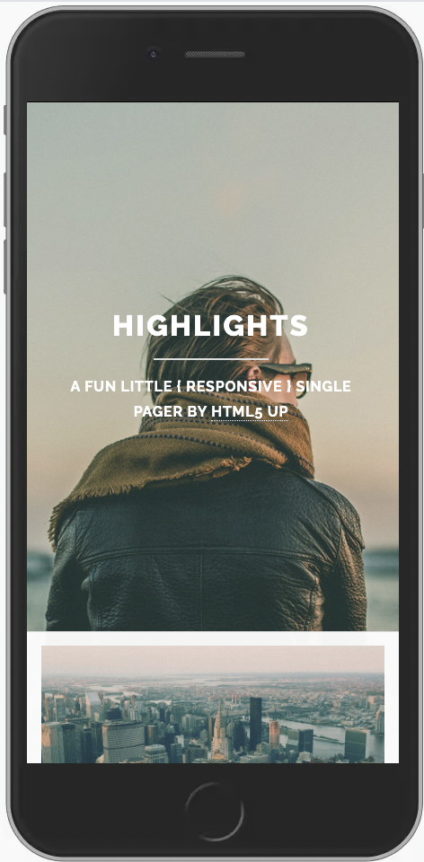
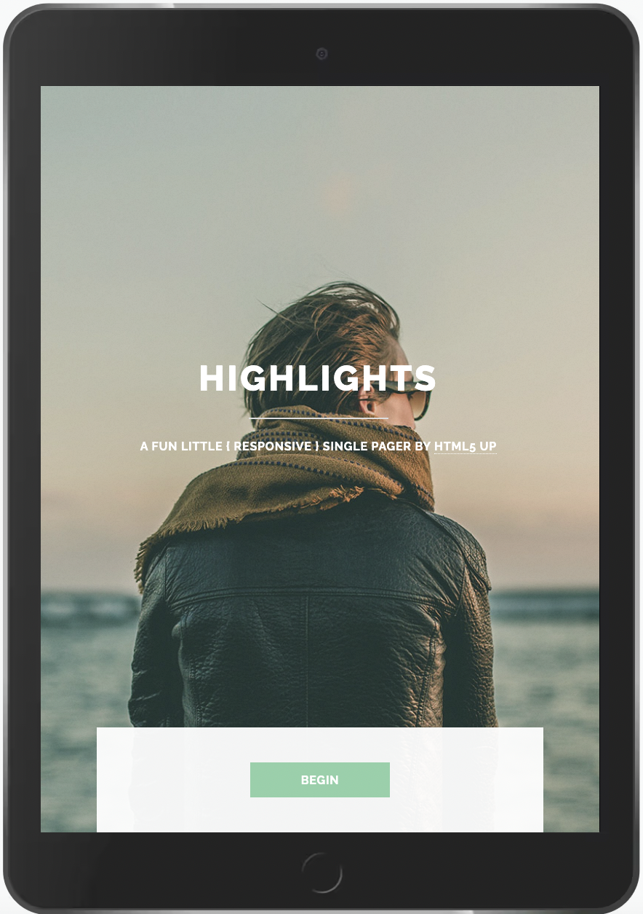

# Bau die folgende Seite pixel-perfekt nach


## Weitere Infos

- Nutz alle Möglichkeiten die du bisher gelernt hast
- Weitere mockups findest du im [> mockups](./mockups) Ordner
- Benutze die Schriftart "Raleway" von Google Fonts 
- Benutze die Bilder aus dem [> images](./images) Ordner für die Seite 
- Alle Überschriften haben die Farbe ```#61686b```
- Der restliche Text und die Icons haben die Farbe ```#6f7577```
- Der Button hat die Farbe ```#8cd1a8```
- Tipp: du kannst Farben auch transparent machen z.B: ```rgba(255,255,255,0.5)``` (Weiß mit 50% Deckkraft)
- Benutze FontAwesome Icons 
- Und am aller wichtigsten: Benutz Google wenn du etwas nicht weißt oder vergessen hast. 
Versuche dich langsam daran zu gewöhnen Lösungen selbst zu finden. 


## Mockup Handy



## Mockup Tablet



